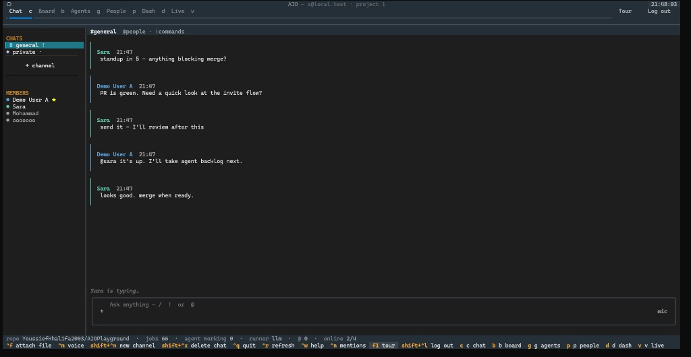

<p align="center">
  
</p>

<h1 align="center">AIO</h1>

<p align="center">
  <strong>The multi-agent workplace that lives in your terminal</strong>
</p>

<p align="center">
  <a href="#quick-start"></a>
  <a href="#stack"></a>
  <a href="#stack"></a>
  <a href="#license"></a>
</p>

<p align="center">
  Team chat · private AI rooms · objectives board · live presence · owner analytics<br/>
  <em>Native terminal app · shared FastAPI backend · no browser required</em>
</p>

<p align="center">
  
</p>

<p align="center">
  <code>aio</code> terminal &nbsp;·&nbsp; HTTP API &nbsp;·&nbsp; legacy web at <code>/app</code>
</p>

<p align="center">
  <a href="#quick-start"><strong>Quick start</strong></a>
  &nbsp;·&nbsp;
  <a href="#living-in-the-app">Living in the app</a>
  &nbsp;·&nbsp;
  <a href="#creating-chats">Creating chats</a>
  &nbsp;·&nbsp;
  <a href="#features">Features</a>
</p>

<pre>
uvicorn app.main:app --port 8000   # terminal 1
aio                                # terminal 2
</pre>

---

## Why AIO

| Problem | What AIO does |
|--------|----------------|
| Agents clutter shared chat | **`/skills` in AI chats**; channel `!` traffic is **whisper-only** |
| Slack + Linear + Cursor = tab hell | **One terminal surface** for people, work, and agents |
| “Who’s here?” missing in CLI tools | **Online dots** + **“Sara is typing…”** |
| Who can create what? | **Members → private only** · **Owners → public or private** · pick **`!` or `/` AI** |
| Demo / onboard friction | Guided **Tour** · invite links |

Built for teams of ~5-6 who want serious agent workflows without leaving the shell.

---

## Table of contents

- [Quick start](#quick-start)
- [Living in the app](#living-in-the-app)
- [Creating chats](#creating-chats)
- [Mental model](#mental-model)
- [Features](#features)
- [CLI reference](#cli-reference)
- [Configuration](#configuration)
- [Demo accounts](#demo-accounts)
- [Develop](#develop)
- [Stack](#stack)
- [Non-goals](#non-goals-v1)
- [License](#license)

---

## Quick start

```bash
git clone <your-repo-url>
cd WORK

python3 -m venv .venv
# macOS / Linux
source .venv/bin/activate
# Windows PowerShell
# .\.venv\Scripts\Activate.ps1

pip install -r requirements.txt
cp .env.example .env
# Add at least one LLM key - see Configuration

./aio seed                                          # or: aio seed
uvicorn app.main:app --host 0.0.0.0 --port 8000     # keep the API running
```

Second terminal:

```bash
./aio doctor    # API · git · workspaces · GitHub · research · coding runners
./aio           # always opens the Sign in screen, then the workspace
```

Credentials are saved after a successful Sign in (`~/.aio/credentials.json`, mode `600`).  
`aio`, `aio tui`, and `aio up` open the same app (Sign in gate every time).

```bash
rm -f aio.db && ./aio seed          # reset demo data
# Windows: del aio.db ; aio seed
```

> **Important:** restart `uvicorn` after pulling code so new API routes (presence, create-chat options) load.

---

## Living in the app

### Navigation

| Keys | Opens |
|------|--------|
| `c` `b` `g` · `1`-`3` | **Chat** · **Board** · **Agents** *(everyone)* |
| `p` `d` `v` · `4`-`6` | **People** · **Dash** · **Live** *(owner only - hidden for members)* |
| `?` | Keys & commands |
| `@N` button · `ctrl+n` | Unread @mentions (who · time · chat · snippet → jump) |
| `ctrl+r` · `q` | Refresh · quit |
| `Tour` / `Log out` | Walkthrough · sign out (marks you offline immediately) |

### Chat

| Prefix | Role |
|--------|------|
| `/` | AI skills - when the chat’s mode is **AI** (`/ask` `/deepresearch` `/code` …) |
| `!` | Board / ops - **whispers** in public channels (only you see the exchange) |
| `@` | Ping people · sound + `@N` button (or `ctrl+n`) to jump |

Also: **`+` attach** · **mic** · hover **edit / delete** · speaker blocks · **online** dots · **typing** in public channels.

---

## Creating chats

Press **`+ channel`** (or `ctrl+shift+n`).

| | **Member** | **Owner** |
|--|------------|-----------|
| Visibility | **Private only** (only you) | **Public** (team) or **Private** (only you) |
| Purpose | **`!` commands** or **`/` AI skills** | Same choice |

Sidebar cues: `# name` = public · `◆ name` = private · trailing `!` or `/` = purpose.

| Mode | What works |
|------|------------|
| **`!` commands** | Board/ops bangs · `/clear` · human chat in public rooms |
| **`/` AI skills** | Full `/ask` `/code` `/deepresearch` … (in **public** AI chats, skill traffic is **whisper-only**) |

Your seeded **◆ my room** stays the default private AI room (`/`). **#general** stays the team ops channel (`!`).

---

## Mental model

| Surface | For |
|---------|-----|
| Public `#channels` | Humans - talk, @ping; `!` stays private to you |
| Private `◆` chats | Only you - ops or AI depending on mode |
| Board / `!` | Shared work graph |
| Owner tabs | Roster admin + analytics |

**People in public channels. Agents where you enable AI. Work on the board.**

---

## Features

### Team chat
- Public channels + private chats (create flow above)
- Speaker blocks, markdown, timestamps
- @mentions with autocomplete, unread flash + sound
- Attachments (PDF / images / text → agent context)
- Edit own messages (keeps later user lines; refreshes following agent replies)
- **Presence**: online / offline (fast offline on logout / quit)
- **Typing**: `Sara is typing…` in public channels
- Optional mic (Whisper) / TTS when Groq is set

### AI skills

| Skill | Purpose |
|-------|---------|
| `/ask` | General Q&A (+ attachments) |
| `/deepresearch` | Sourced briefing via Tavily |
| `/code` · `/write` · `/review` · `/checklist` | Build, draft, check, break down |
| `/status <name>` | AI catch-up (owner; whisperable) |

### Board & GitHub
- Columns through `agent_backlog` → `in_review` → `done`
- Real repo / PR / branch badges
- Optional Codex / Claude Code runners
- Owner **Merge & done** after GitHub confirms

### Onboarding & ops
- Spotlight **Tour**
- Invite links · optional Teams webhook
- Scriptable CLI for CI
- Legacy web UI at `/app`

### Commands (`!`)

Type `!help`. In public channels, command traffic is **whisper-only**.

| Area | Examples |
|------|----------|
| Work | `!add` · `!list` · `!set` · `!done` · `!assign` |
| Links | `!link <id> branch` · `!link <id> pr` |
| Issues | `!issue` · `!issues` · `!resolve` |
| Room | `!invite` · `!clear` · `!help` |

---

## CLI reference

| Command | Purpose |
|---------|---------|
| `aio` | Open the app |
| `aio login` · `logout` · `whoami` | Credentials |
| `aio doctor` | Preflight |
| `aio board` · `aio card` · `aio set` · `aio merge` | Board loop |
| `aio chat` · `aio say` | Script chat |
| `aio seed` | Demo tenant + users |

```bash
./aio board
./aio set 12 agent_backlog --runner codex
./aio merge 12 --yes
```

---

## Configuration

Copy `.env.example` → `.env`.

| Variable | Purpose |
|----------|---------|
| `GEMINI_API_KEY` | Gemini models |
| `OPENROUTER_API_KEY` | Free model picker |
| `GROQ_API_KEY` | TTS + Whisper |
| `TAVILY_API_KEY` | `/deepresearch` sources |
| `GITHUB_TOKEN` / `GITHUB_REPO` | Agent PRs |
| `CODING_BACKEND` | Keep `llm` for chat; use board runners for Codex/Claude |
| `CODEX_API_KEY` / `ANTHROPIC_API_KEY` | Board coding CLIs |
| `DATABASE_URL` | Default `sqlite:///./aio.db` |
| `API_BASE_URL` | Owner CLI → local API (`http://127.0.0.1:8000`) |
| `INVITE_APP_URL` | Public join-link origin (tunnel HTTPS for off-LAN) |

### Invites off-LAN

Keep `API_BASE_URL=http://127.0.0.1:8000` on the API host. Expose the API with a tunnel, point invites at it, remint:

```bash
uvicorn app.main:app --host 0.0.0.0 --port 8000
cloudflared tunnel --url http://127.0.0.1:8000
# set INVITE_APP_URL=https://xxxx.trycloudflare.com  then restart uvicorn
# !invite   (discard old 10.x links)
```

New members: open the join link → Done → run `aio` → paste **Server** from the Done page → email/password.

### Coding runners (Codex / Claude Code)

OpenRouter/Gemini power `/ask` and the Agents tab. Codex and Claude Code run when you send a **board** card to agent backlog with that runner (owners: any card; members: cards they created or are assigned to). Members only **see** their own/assigned cards; owners see the full board.

```bash
aio doctor                                          # CLIs + keys
# Board: select card → a → pick codex | claude_code | llm
aio set 12 agent_backlog --runner codex
aio set 12 agent_backlog --runner claude_code
aio board-wipe --yes                                # owner: clear all cards + local workspaces
```

**Interactive Claude / Codex** (full CLI in a new terminal — not an LLM skill):

- Chat bangs: `!claude` · `!codex`

Do not set `CODING_BACKEND=codex` globally unless you intend chat `/code` to prefer that stack; prefer per-card runners.

## Demo accounts

Password: **`demo`**

| Email | Role |
|-------|------|
| `a@local.test` | **Owner** - public chats, People, Dash, Live, merge |
| `omar@local.test` | Member - private chats only + Chat / Board / Agents |
| `sara@local.test` | Member - same |

### Two-minute demo

```bash
./aio
# Owner: + channel → Public + / AI → team AI lounge (whispers)
# Member: + channel → Private + ! → personal ops room
# Two logins: online dots + typing in #general
# Quit / Log out → goes offline quickly for others
```

More prompts: [`commands.txt`](commands.txt).

---

## Develop

```bash
source .venv/bin/activate
pytest -q
uvicorn app.main:app --host 0.0.0.0 --port 8000 --reload
```

```bash
python scripts/tui_smoke.py --shot
python scripts/tui_pty_check.py
```

---

## Stack

| Layer | Choice |
|-------|--------|
| API | FastAPI + Uvicorn |
| Data | SQLite (WAL) · SQLAlchemy · Postgres via `DATABASE_URL` |
| Terminal | Textual + Typer + Rich |
| Web | Vanilla JS `/app` |
| Agents | Gemini · OpenRouter · Codex / Claude Code |
| Research | Tavily |
| Presence | HTTP poll (no Redis / WebSockets required) |

---

## Non-goals (v1)

- Lead reading another user’s private prompts  
- Public SaaS · mobile · WebSockets-first transport  
- Auto-merge from chat · per-user GitHub OAuth  

---

## License

**Private / internal.** Adjust before publishing if you open-source.

---

<p align="center">
  <sub>AIO - public for the team · private for you · ! for work · / for agents.</sub>
</p>
